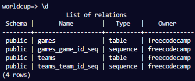
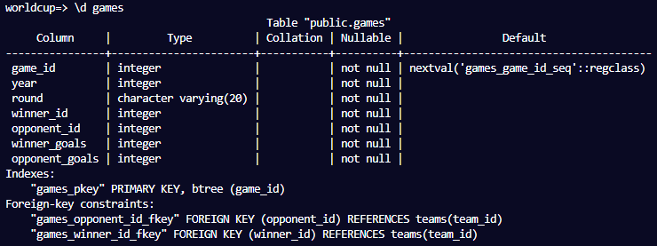
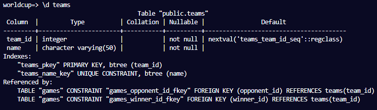
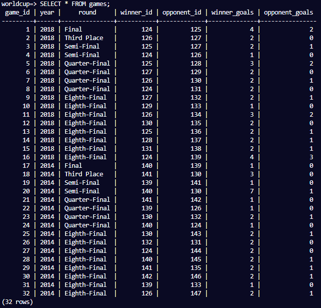
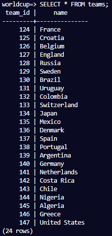
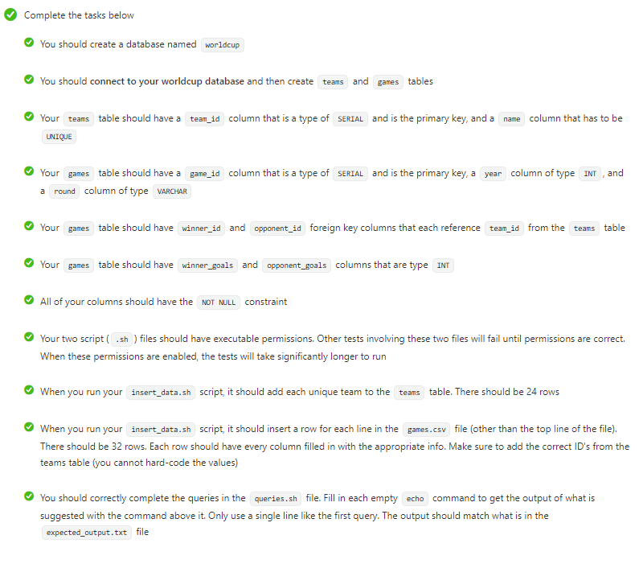

# World Cup Database

- This World Cup database was built using a shell script to insert data from a CSV file into a PostgreSQL database.

Technologies used: PostgreSQL, Shell Script

# Live Version Output

# Requirements

